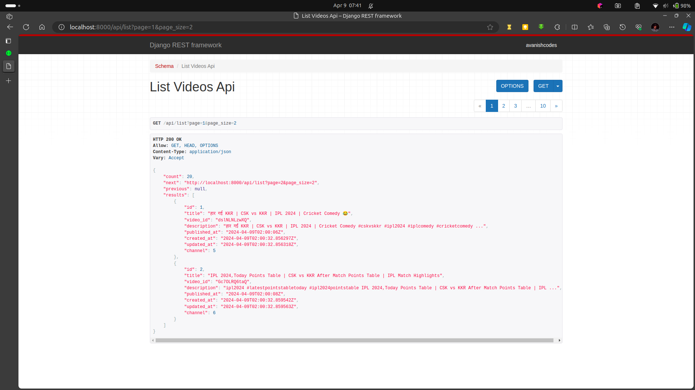
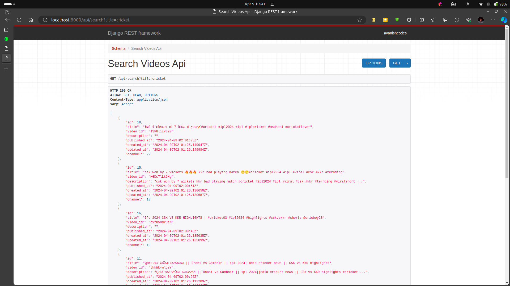

# YouTube Mini

## Deployment

- `docker build -t ytmini .`
- `docker run -d -p 8000:8000 ytmini`
- `docker exec -it <container_id> python manage.py runserver 0.0.0.0:8000`
- `docker exec -it <container_id> python manage.py createsuperuser`
- `docker exec -it <container_id> python manage.py migrate`

### Save the API key in the database
- `docker exec -it <container_id> python manage.py shell`
- `from api.models import YoutubeAPIKey`
- `YoutubeAPIKey.objects.create(key='<api_key>')`

Now the server is ready to use.

## Images
### List Videos API

### Search Videos API
